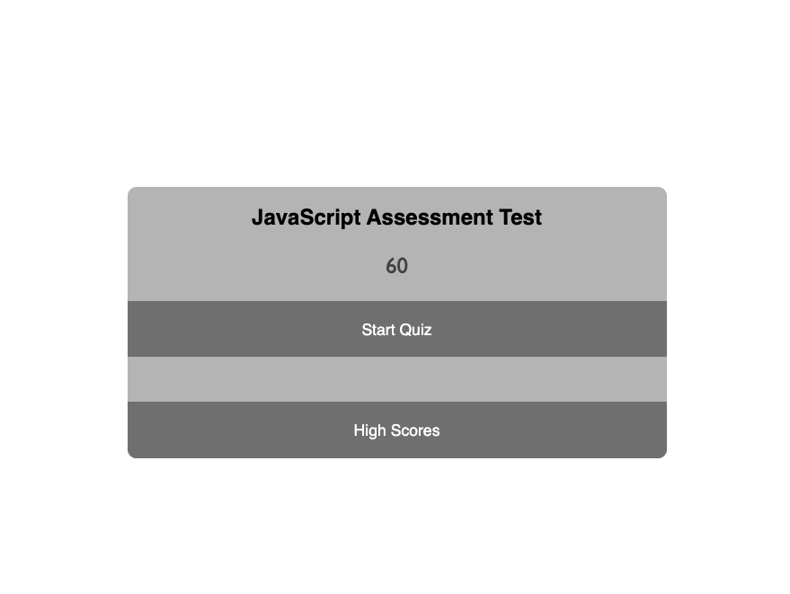
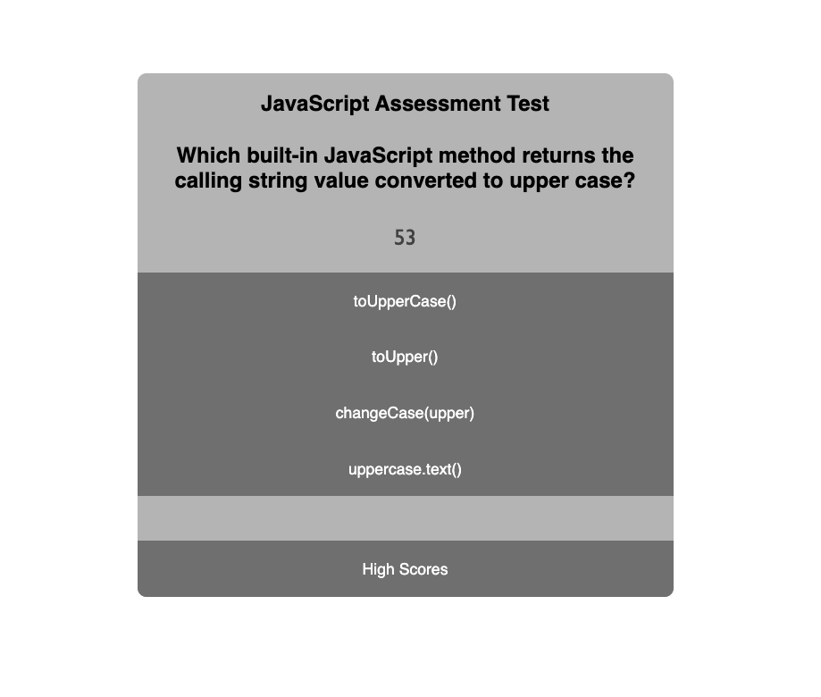
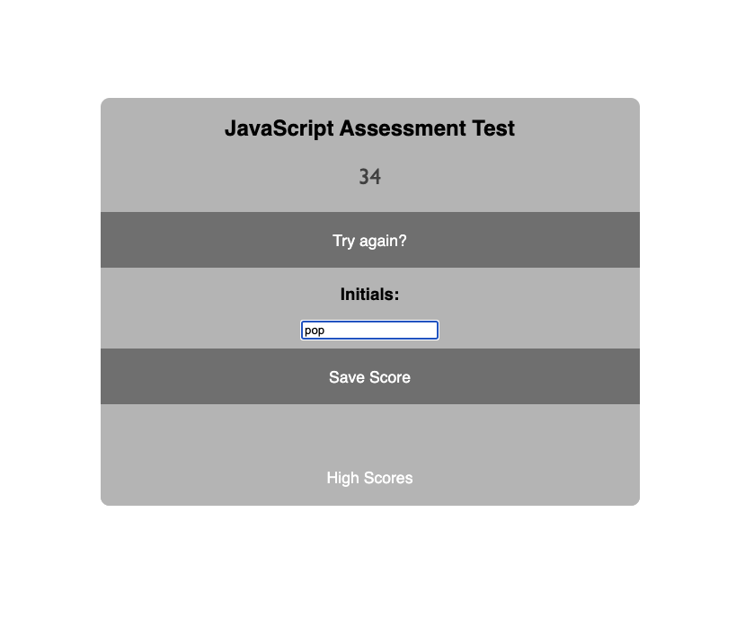
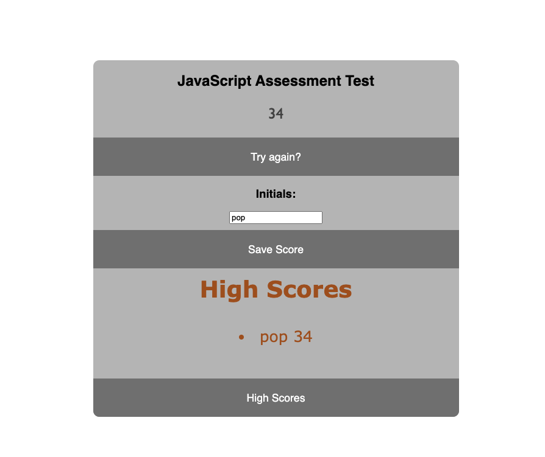

# challenge-4-coding-quiz

In this challenge I created a simple coding assesment test with 4 questions. 

When the user clicks the "start quiz" button, the timer at the top begins to count down from 60 seconds. 
The multiple choice question and answers are listed for the first question. 

If the user selects the correct answer, the word "correct" appears on the screen in green, 2 seconds pass, and then the next question appears.
If the user selects the incorrect answer, the word "incorrect" appears on the screen in red, 5 seconds are deducted from their total time, and then the next question appears. 

At the end of the 4 questions, or when time runs down to 0, the quiz ends and the timer stops. The final remaining seconds are the final score.
The user can then input their initials, and when they press "save score" their score is saved to their local storage. 

When the user clicks the "high scores" button, the previous scores are taken from local storage and presented on the screen with the corresponding intitials.

When the user clicks "try again", the page reloads and the quiz can begin again. 

Here is a link to the deployed application: https://carsonadair.github.io/challenge-4-coding-quiz/

Here are screenshots of the deployed application. 

